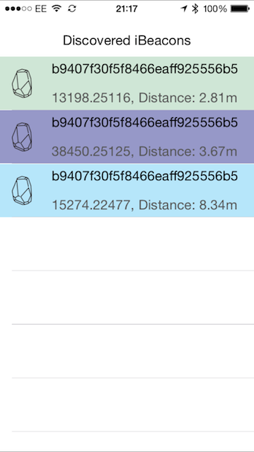

After my [Blog post about binding the Estimote iOS SDK](/blogs/binding-ios-libraries-in-xamarin/), James Montemagno (Developer evangelist at Xamarin) contacted me to say they were about to release an official Xamarin component for accessing Estimote iBeacons and nearables from iOS.  This renders my binding library redundant - which is a good thing as its less work for me now to support it!

I decided to have a quick play today, updating the test application that I created to quickly test my binding to use the new component.  It was pretty much a one to one swap out, all that needed tweaking were the names.  EST was removed from all the names, so things like `ESTBeaconManager` became `BeaconManager`.  Other name tweaks included events being renamed from `DidRangeBeacons` to `RangedBeacons` - nice tidying really that I couldn't be bothered to do when I bound the library.

The only bad naming I've come across so far is their event args classes.  Someone left Args on the name of the classes before binding.  Remember that the binding project automatically adds `EventArgs` to the name of the event args class when it is generated, erroring if it already has `EventArgs` on the end of the name.  In this case it looks like someone set it to end in `Args`, which then gets `EventArgs` prepended.
For example, the RangedBeacons event has the following signature:

```cs
public event EventHandler<RangedBeaconsArgsEventArgs> RangedBeacons
```

Note the rogue `Args` in the middle.

Other than this naming oddity, it all works perfectly.  I've only had a quick look but what I've seen so far is great.  I'm working on an app at the moment which should make a lot more use of the SDK so as I discover things I'll report back.

One big downside though - it's iOS only.  There is an existing component for Android but this is lacking in functionality.  Hopefully Xamarin will do an offical Android component soon.

I've updated my GitHub project to use the component, but left the original binding project there for reference.  It's at:

https://github.com/jimbobbennett/EstimoteBinding

The sample project is a Xamarin.Forms project - only with the iOS and PCL projects at the moment until there is an Android component available.  It uses the Forms `DependencyService` to resolve a wrapper around the `BeaconManager` and `Beacon` classes from the component.  Should be self explanatory but ping me if you want me to explain anything in more detail.



