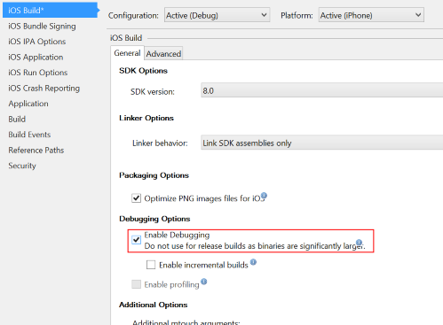
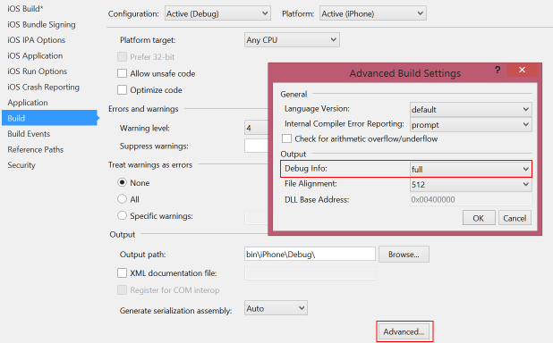

At the moment Xamarin are holding their annual Evolve conference in Atlanta.  Unfortunately I'm not there, but I've been keeping up to date with their announcements and one caught my eye - [Xamarin Insights](http://blog.xamarin.com/monitoring-your-apps-with-xamarin-insights/).  I've been looking for a Xamarin compatible analytics and crash reporter for a while and it looke like this does the job.

So far I've loked at:

* Flurry - analytics but no iOS 8 Xamarin bindings
* HockeyApp - crash reporting but no analytics
* Crashlytics - I have no idea what this is as they have a stupid website and a weird invitation process that I can't be bothered to wade through.

There is no all in one Xamarin compatible solution that I have seen, but Insights seems to be what I'm looking for.  It provides event tracing so you can see what bits of your app are being used, crash reporting with upload of dSym files for tracking crashes including seeing the stack and user tracking.
It was a bit flakey when I started using it - crash reports wouldn't show and no user were visible but it improved over the day.  I guess Xamarin are hard at work ensuring it's all working properly as it was only just announced.

It's pretty easy to set up - just import the NuGet package then call `Insights.Initialize("your app id");`.  After that you can track events using `Insights.Track("event name");` and can even pass event data to the track call.

I included it in my latest app beta and it picked up a crash that happened.  Unfortunately even though I had uploaded the dSYM file, it wasn't showing the stack trace.  A bit of investigation on my side found the issue - I hadn't included debug symbols in my build.  These have to be turned on so it can link the stack trace back to the lines of code.  Easy enough to do in VS.

It's well worth a try - free to existing Xamarin subscribers during their beta.  Hopefully when pricing is announced it'll be reasonable.
I'm also hoping it'll include distribution as well, it would be nice to upload a build from VS/XS including the dSym file and distribute it to testers and get data back instead of having to also use tools like TestFlight.

